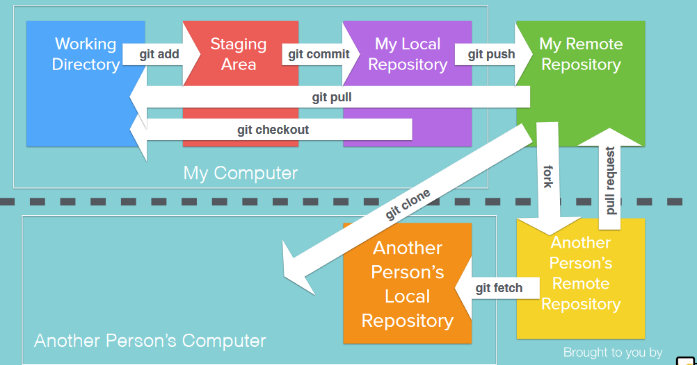

<h1>Github</h1>

<h3>How to push your local project into github</h3>
--->we need to enter these command "git init" in terminal
--->After that we need to add the files by using the command "git add filename" or "git add ."
--->we need to commit the file to our local repository by using the command "git commit -m "yourmessage"
--->we need to create repository in your github account and copy the HTTPSLink.
--->we need to enter this command to specify the path of your repo by using "git remote add origin HTTPSLink".
--->we need to push the file to remot by using "git push origin master"

<h3>Pictorial working flow</h3>

